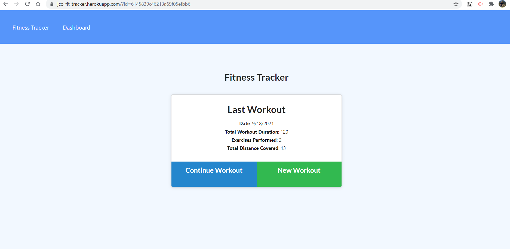

# fitness-tracker 
My Fitness Tracker
  
## Description
***

The **The fit tracker** is a website that was devolped to provide the user a way to store and retreive data of completed exercise routines. The page dashboard generates two charts with the information on how many pounds were lifted per day and workout duration per day.


## Table of Contents
***  

- [Installation](#installation)
- [Usage](#usage)
- [How to Contribute](#How)
- [Tests](#Tests)
- [Questions](#Questions)
- [License](#license)

  
  
## Installation
***

  The installation can be completed by following these instructions:
    
1. To install a Node JS project, install [Node JS](https://nodejs.org/)       

2. Clone the GitHub repository to you local computer. Click on the following link.
 
  * Repository link : https://github.com/jcorozco81/fitness-tracker

3. Download and install [MongoDB](https://www.mongodb.com/).


Additional packages required: 

1. To install additional packages, first initialize the repository with a ```package.json``` file by running ```npm init -y```.

2. [mongoose package](https://www.npmjs.com/package/mongoose): To install mongoose run the following command: ```npm i mongoose```. This will add it to the list of dependencies. 

3. [Express package](https://www.npmjs.com/package/express): To install express run the following command: ```npm i express```. This will add it to the list of dependencies.

6. [Nodemon package](https://www.npmjs.com/package/nodemon): To install nodemon run the following command: ```npm install -g nodemon```. This will add it to the list of dependencies.

7. [morgan package](https://www.npmjs.com/package/morgan): To install morgan run the following command: ```npm install morgan```. This will add it to the list of dependencies.


## Usage
***
   
   1. Load the database by executing the following command ```npm run seed```.
   
   2. To execute the script, open a Git terminal on the main project folder (cloned folder) Run the following command: ```node server.js``` or ```npm start```.

Or

1. The deployed application can be found at this site: [Fitness Tracker](https://jco-fit-tracker.herokuapp.com/)
  
 

## How to Contribute
***

  Developers who are interested in contributing ideas for this application must agree to follow and comply with the Contributor Covetnant: Code of Conduct. The Contributor Covenant Code of Conduct can be found in the following address:

  [Contributor Covenant Code of Conduct](https://www.contributor-covenant.org/version/2/0/code_of_conduct/code_of_conduct.md/)


## Tests
***
  No test cases were created for this project.


## Questions
***
  
  You can find additional projects on my github page: https://github.com/jcorozco81.

  If you have any questions please contact me at my E-Mail address: jcorozco@gmail.com.


## License
***

Copyright (c) 2021 jcorozco81 and Trilogy Education Services, LLC, a 2U, Inc. brand.


This software/code is licensed under the MIT License; to use this software/code you must agree to follow and comply the License. A copy of the License can be found at:

https://www.mit.edu/~amini/LICENSE.md